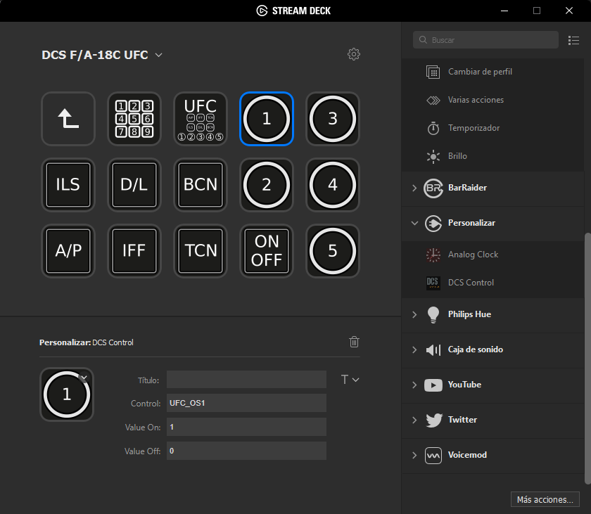

# streamdeck-dcs

This Plugin (avionics.madjack.dcs.streamDeckPlugin) for Stream Deck allows you to send commands (controls) to DCS (via DCS-Bios).

Based on the sample plugin `CPU` from the [Stream Deck SDK](https://developer.elgato.com/documentation/stream-deck/).

# Features

- code written in C++

Icons on the screenshot are the work of pellelil, and you can find them here: [Stream Deck profile for DCS F18](https://www.digitalcombatsimulator.com/en/files/3303670/)

# Installation

In the Release folder, you can find the file `avionics.madjack.dcs.streamDeckPlugin`. Double-click this file and Stream Deck will install the plugin. Of course, you need at least one Stream Deck device, and its software.

# Source code

The Sources folder contains the source code of the plugin. 

